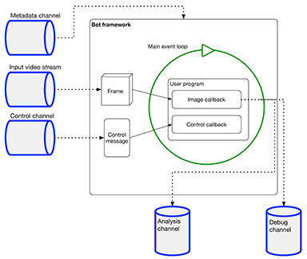

# Satori Video C++ SDK Concepts
## SDK Overview
The Satori Video SDK is a platform for processing streaming video. It includes a bot framework that you combine with
your image processing code to build a **video bot**. The C++ libraries in the bot framework decode video into frames
that it passes to your image processing callback. In this callback, your image processing code analyzes, re-publishes,
or transforms the frames. The SDK also has an API that connects your code to the libraries, publishes image processing
results and telemetry, and receives control information.

To support live streaming video, the SDK uses publish/subscribe **channels** provided by
[Satori](https://wwwstage.satori.com/docs/introduction/new-to-satori). The SDK also uses channels to receive video
metadata and publish results. For testing, you can configure your bot to use file or camera input.

The SDK has these components:
* The bot framework (C++ libraries) that you statically link with your program to create a video bot. The bot framework
handles low-level tasks and provides the platform for your image processing code.

* The C++ library API
* Command-line utilities that publish, play back, and record video streams
* Code examples that show you how to use the SDK for common video-processing tasks

## Satori Video architecture
At the heart of a video bot is the **main event loop**. During the lifetime of the loop, the bot framework
receives streaming video from a channel, decodes it, assembles a video frame, and passes the frame to your
image-processing callback.

In this callback, you can analyze the current frame, store it in memory for later use,
transform it, and re-publish it. Using the API, you can publish analysis, metadata, and debug messages to channels
that the bot framework pre-defines for your bot.

The bot framework also *receives* messages from a pre-defined control channel for your bot. When a message
arrives, the framework passes it to the control callback you've registered. The control callback
lets you set up your bot during initialization and control its behavior as the bot runs.

## Satori Video lifecycle
The lifecycle of video processed by the Satori Video SDK follows these steps:<br>
• Provide video source<br>
• Start up video bot<br>
• Run main event loop<br>
• Process video and publish results<br>
### Provide video source
Before you run your video bot, you need to provide a source of compressed video.

You can provide source video from these sources:<br>
• Satori video channel<br>
• Video camera<br>
• Video file<br>

When you publish video to a channel, the utility also publishes
metadata for the video to a separate metadata channel. As the bot framework receives video, it also receives information
about the video stream from the metadata channel.

The SDK gets metadata for a file from the file itself. The video camera also provides metadata to the SDK.

* For a list of SDK utilities that provide video streams, see [Command-Line Utilities](docs/reference.md#cli)
* For more information about SDK channels, see [SDK channel names](docs/reference.md#sdk-channel-names).
### Start up video bot
To start your bot, you run it from a command line. You can pass command line parameters to the bot, as well as
your own configuration parameters. See
[Video bot command line parameters](docs/reference.md#video-bot-command-line-parameters).

Based on your command line parameters, bot framework subscribes to the video channel and its associated metadata
channel, and the control channel. The names of the metadata and control channel are based on the video channel
name. See [SDK channel names](docs/reference.md#sdk-channel-names).

Your code calls the API function `bot_register()` to set the video format of your incoming
video messages, the name of your image processing callback, and the name of your control message callback.
Then you call the API function `bot_main()` to start the main event loop.

Before it starts processing video, the framework invokes your control callback, passing it a CBOR message containing
the configuration parameters you specified on the command line. At this point, you can set up the overall configuration
of your bot and store it in the global context.
### Run main event loop
The bot framework runs the main event loop. It receives messages from the video stream channel, decodes them,
re-assembles them into a video frame, and invokes your image processing callback with the frame as a parameter. When
your callback finishes, the loop does its next iteration.

The framework also invokes the control callback whenever it receives a message from the control channel.
### Process video
In your image processing callback, you can analyze, transform, and republish the video frame. You can publish results
to a file or to the analytics channel that the framework provides you.

During processing, you can publish results to the analytics channel. You can also publish debug messages to the
debug channel. The names of these channels are based on your input video channel name.
See [SDK channel names](docs/reference.md#sdk-channel-names).
## Video bot environment
Video bots are statically linked, so they don't depend on dynamic  has no
outside dependencies, so you can run a video bot on any Mac or Linux platform. Because you can use Satori channels for
all input and output, including control and configuration, video bots are well-suited to running in a cloud
environment such as Docker.

## Bot structure
This is an example of C++ code for the program you provide:
```cpp
#include <iostream>
// header for Satori Video API functions
#include <satorivideo/video_bot.h>

//
// Satori video libraries
namespace sv = satori::video;

namespace sample_bot {

//
// Defines an image processing callback
//
// context: Persistent video context object. See bot_context
// frame: A video frame passed to the callback by the SDK framework

void process_image(sv::bot_context &context, const sv::image_frame &frame) {
    // Sample: prints out a message each time the callback receives a frame
    std::cout << "got frame " << context.frame_metadata->width << "x"
            << context.frame_metadata->height << "\n";
}
//
// Defines a command callback
// The SDK framework invokes this in 2 situations:
// 1) At initialization, after you call bot_register()
// 2) When the framework receives a message from the control channel
//
// context: The persistent bot context
// message: Message in CBOR format
cbor_item_t *process_command(sv::bot_context &context, cbor_item_t *message) {
  std::cout << "bot is initializing, libraries are ok" << '\n';
  return nullptr;
}

} // namespace sample_bot

// Main function of the video bot
int main(int argc, char *argv[]) {

  // Registers your code with the video bot
  sv::bot_register(sv::bot_descriptor{sv::image_pixel_format::BGR,
                                      &sample_bot::process_image,
                                      &sample_bot::process_command});
  // Starts the video bot main event loop
  return sv::bot_main(argc, argv);
}
```

## SDK distribution
To learn how to obtain the SDK, see [Get the SDK](docs/tasks.md#getsdk)

## OpenCV support
The Video SDK includes support for the **OpenCV** library of real-time computer vision functions.

Because OpenCV functions use the OpenCV `Mat` object, the Video SDK provides an additional OpenCV-oriented API
that replaces the default API. To learn more about this API, see [OpenCV API](docs/reference.md#opencv).

## Frame identifier
The framework assigns a **frame identifier** to each video frame it decodes from the input stream. This
identifier is a sequence number rather than a time code, and it helps you manage and annotate frames.

The identifier is stored as two 64-bit integers, each of which contains the same sequence number. In the C++ API,
the identifier is represented by the `frame_id` type struct that has two fields, `id1` and `id2`.

The `bot_message()` API function accepts a `frame_id` value as an optional parameter, which becomes part of the
published message. If you want mark the message as applying to a range of frames, use `id1` to refer to the first
frame in the range, and `id2` to refer to the last frame.
## Execution mode <a name="execmode"></a>
The framework provides two **execution modes** that let you control how your image processing callback
processes frames:
* **LIVE:** The framework drops frames instead of sending each frame to your callback.<br><br>
For example, suppose you're running in live mode, and the framework invokes your callback with frame 1. While you're
processing this frame, the framework decodes frames 2 through 6. When your callback returns, the framework invokes your
callback with frame 7, dropping the other frames.<br><br>Live mode works with channel streams, files, and cameras.<br><br>
**Note: Always use live mode when you run your bot in production.**

* **BATCH:** The framework waits for your callback instead of dropping frames. The framework doesn't send the next
frame until your callback returns. When the framework invokes your callback again, it sends the next sequential frame.<br><br>
For example, suppose you're running in batch mode, and the framework invokes your callback with frame 1. While you're
processing frame 1, the framework decodes frames 2 through 6. When your callback returns, the framework invokes your
callback with *frame 2*. Your callback has the opportunity to process every frame in the stream.<br><br>
Batch mode only works with files. It's provided so you can test your bot during development. **Don't use batch mode
in production.**
## Bot context
The context for a bot is a C++ variable that communicates settings to the framework and persists data across iterations
of the main event loop. Use the `instance_data` pointer in the variable to point to your own global information. The
framework passes the context as a parameter whenever it invokes your image processing or control callback.

## Logging and debugging
The bot framework provides a debug channel name based on the video channel name. To publish debug messages to it,
call `bot_message`.

To learn about SDK channels, see [SDK channel names](docs/reference.md#sdk-channel-names).

The bot framework uses [Loguru](https://github.com/emilk/loguru) for logging. You can use it to do your own
logging, but you can also use any other logging framework you want.

## Prometheus support
Support for the Prometheus metrics library is built into the framework. The bot context contains a variable you can
use to store a Prometheus `Registry` object. Use of the library is optional.
## Docker support

## Supported video data formats
The framework supports the following frameworks:<br>
• MPEG-4 Part 10 (H.264) and MPEG-4 Part 2 compressed video. File extension is `.mp4`.<br>
• Matroska Multimedia Container (**MKV**). File extension is `.mkv`.<br>
• WebM. File extension is `.webm`.<br>


